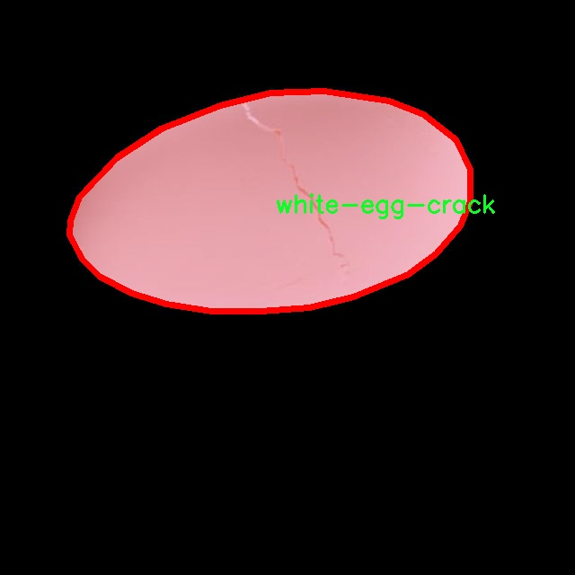

# 鸡蛋裂纹分割系统： yolov8-seg-C2f-DCNV3

### 1.研究背景与意义

[参考博客](https://gitee.com/YOLOv8_YOLOv11_Segmentation_Studio/projects)

[博客来源](https://kdocs.cn/l/cszuIiCKVNis)

研究背景与意义

随着全球对食品安全和质量的关注日益增强，鸡蛋作为一种重要的蛋白质来源，其生产和加工过程中的质量控制显得尤为重要。鸡蛋的裂纹不仅影响其外观质量，还可能导致细菌污染，进而影响消费者的健康。因此，开发一种高效、准确的鸡蛋裂纹检测与分割系统，对于提升鸡蛋的市场竞争力和保障食品安全具有重要的现实意义。

近年来，计算机视觉技术的迅猛发展为农业产品的质量检测提供了新的解决方案。特别是基于深度学习的目标检测与分割技术，已在多个领域取得了显著成效。其中，YOLO（You Only Look Once）系列模型因其高效的实时检测能力和较好的准确性，逐渐成为目标检测领域的研究热点。YOLOv8作为该系列的最新版本，具备了更强的特征提取能力和更快的推理速度，为复杂场景下的物体检测提供了有力支持。然而，针对鸡蛋裂纹这一特定应用场景，现有的YOLOv8模型仍存在一定的局限性，尤其是在细粒度特征分割和多类别识别方面。

本研究旨在基于改进的YOLOv8模型，构建一个专门针对鸡蛋裂纹的分割系统。我们将利用一个包含3000张图像的数据集，该数据集涵盖了四个类别：棕色鸡蛋裂纹、棕色鸡蛋、白色鸡蛋和白色鸡蛋裂纹。这一多样化的数据集为模型的训练和验证提供了丰富的样本，有助于提高模型的泛化能力和准确性。通过对裂纹的精确分割，我们能够实现对鸡蛋质量的自动化评估，进而提升生产效率和降低人工成本。

此外，鸡蛋裂纹分割系统的开发不仅具有学术研究的价值，也为实际应用提供了可能。该系统可以广泛应用于鸡蛋生产、加工和销售等环节，帮助企业实现智能化管理，提升产品质量监控水平。通过自动化的裂纹检测，企业能够及时发现和剔除不合格产品，降低食品安全风险，增强消费者信任。

综上所述，基于改进YOLOv8的鸡蛋裂纹分割系统的研究，不仅填补了当前在鸡蛋裂纹检测领域的技术空白，也为深度学习在农业产品质量控制中的应用提供了新的思路和方法。通过该研究，我们希望能够推动农业智能化的发展，为实现可持续农业生产贡献一份力量。

### 2.图片演示


注意：本项目提供完整的训练源码数据集和训练教程,由于此博客编辑较早,暂不提供权重文件（best.pt）,需要按照6.训练教程进行训练后实现上图效果。

### 3.视频演示

[3.1 视频演示](https://www.bilibili.com/video/BV1cVUHYsELP/)

### 4.数据集信息

##### 4.1 数据集类别数＆类别名

nc: 4
names: ['brow-egg-crack', 'brown-egg', 'white-egg', 'white-egg-crack']


##### 4.2 数据集信息简介

数据集信息展示

在本研究中，我们采用了名为“3000 eggs”的数据集，以训练和改进YOLOv8-seg模型，旨在实现对鸡蛋裂纹的高效分割与识别。该数据集包含3000个样本，涵盖了多种类型的鸡蛋及其裂纹特征，为模型的训练提供了丰富的多样性和广泛的应用场景。数据集的设计充分考虑了鸡蛋的外观特征及其在不同环境下的表现，确保了模型在实际应用中的鲁棒性和准确性。

该数据集共分为四个类别，具体包括：棕色鸡蛋裂纹（brow-egg-crack）、棕色鸡蛋（brown-egg）、白色鸡蛋（white-egg）以及白色鸡蛋裂纹（white-egg-crack）。每个类别的样本数量均衡，确保了模型在训练过程中不会偏向某一特定类别，从而提高了分类和分割的精度。棕色鸡蛋与白色鸡蛋的裂纹特征各具特色，前者通常呈现出较为明显的裂纹，而后者则可能因其颜色的原因，裂纹的可见性相对较低。这种多样性使得模型能够学习到不同类型鸡蛋的裂纹特征，从而在实际应用中能够更好地适应不同的场景。

在数据集的构建过程中，样本的采集与标注是至关重要的一环。每个样本都经过精细的标注，确保裂纹区域的准确定位和分类。这不仅提高了数据集的质量，也为后续的模型训练奠定了坚实的基础。通过使用高分辨率的图像，数据集能够捕捉到鸡蛋表面细微的裂纹特征，使得模型在分割任务中能够更为精准。

此外，数据集的多样性还体现在样本的拍摄环境上。样本不仅包括不同光照条件下的鸡蛋图像，还涵盖了不同背景和角度的拍摄。这种多样化的环境设置，能够有效提升模型的泛化能力，使其在面对不同实际场景时，依然能够保持较高的识别率和分割精度。

在模型训练过程中，我们将采用数据增强技术，以进一步提高模型的鲁棒性。通过对“3000 eggs”数据集进行旋转、缩放、裁剪等操作，生成更多的训练样本，帮助模型更好地学习到鸡蛋裂纹的特征。这一过程不仅丰富了训练数据的多样性，也在一定程度上缓解了过拟合的问题。

综上所述，“3000 eggs”数据集为改进YOLOv8-seg的鸡蛋裂纹分割系统提供了丰富的样本和多样的特征，确保了模型在训练过程中的有效性和准确性。通过精心设计的数据集，我们期望能够实现对鸡蛋裂纹的高效识别与分割，为农业生产中的鸡蛋质量检测提供有力的技术支持。




### 5.项目依赖环境部署教程（零基础手把手教学）

[5.1 环境部署教程链接（零基础手把手教学）](https://www.bilibili.com/video/BV1jG4Ve4E9t/?vd_source=bc9aec86d164b67a7004b996143742dc)


[5.2 安装Python虚拟环境创建和依赖库安装视频教程链接（零基础手把手教学）](https://www.bilibili.com/video/BV1nA4VeYEze/?vd_source=bc9aec86d164b67a7004b996143742dc)

### 6.手把手YOLOV8-seg训练视频教程（零基础手把手教学）

[6.1 手把手YOLOV8-seg训练视频教程（零基础小白有手就能学会）](https://www.bilibili.com/video/BV1cA4VeYETe/?vd_source=bc9aec86d164b67a7004b996143742dc)


按照上面的训练视频教程链接加载项目提供的数据集，运行train.py即可开始训练



     Epoch   gpu_mem       box       obj       cls    labels  img_size
     1/200     0G   0.01576   0.01955  0.007536        22      1280: 100%|██████████| 849/849 [14:42<00:00,  1.04s/it]
               Class     Images     Labels          P          R     mAP@.5 mAP@.5:.95: 100%|██████████| 213/213 [01:14<00:00,  2.87it/s]
                 all       3395      17314      0.994      0.957      0.0957      0.0843

     Epoch   gpu_mem       box       obj       cls    labels  img_size
     2/200     0G   0.01578   0.01923  0.007006        22      1280: 100%|██████████| 849/849 [14:44<00:00,  1.04s/it]
               Class     Images     Labels          P          R     mAP@.5 mAP@.5:.95: 100%|██████████| 213/213 [01:12<00:00,  2.95it/s]
                 all       3395      17314      0.996      0.956      0.0957      0.0845

     Epoch   gpu_mem       box       obj       cls    labels  img_size
     3/200     0G   0.01561    0.0191  0.006895        27      1280: 100%|██████████| 849/849 [10:56<00:00,  1.29it/s]
               Class     Images     Labels          P          R     mAP@.5 mAP@.5:.95: 100%|███████   | 187/213 [00:52<00:00,  4.04it/s]
                 all       3395      17314      0.996      0.957      0.0957      0.0845


### 7.50+种全套YOLOV8-seg创新点加载调参实验视频教程（一键加载写好的改进模型的配置文件）

[7.1 50+种全套YOLOV8-seg创新点加载调参实验视频教程（一键加载写好的改进模型的配置文件）](https://www.bilibili.com/video/BV1Hw4VePEXv/?vd_source=bc9aec86d164b67a7004b996143742dc)

### YOLOV8-seg算法简介

原始YOLOV8-seg算法原理

YOLOv8-seg是2023年由Ultralytics推出的一款前沿目标检测与分割算法，旨在为计算机视觉领域带来更高效、更精准的解决方案。该算法不仅继承了YOLO系列的优良传统，还在此基础上进行了诸多创新与改进，尤其是在处理复杂场景下的目标检测和分割任务时，展现出了其独特的优势。YOLOv8-seg的设计理念是将目标检测与图像分割任务有效结合，形成一种高效的实时检测与分割系统，适用于各种实际应用场景，如自动驾驶、无人机监控以及农业机器人等。

YOLOv8-seg的核心原理可以追溯到YOLO系列算法的基本框架。YOLO（You Only Look Once）系列算法自YOLOv1发布以来，就以其将目标检测任务转化为回归问题的创新性思路而受到广泛关注。YOLOv8-seg在这一框架的基础上，进一步引入了图像分割的功能，使得算法不仅能够识别目标的位置和类别，还能精确地划分目标的边界。通过将目标检测与分割任务整合，YOLOv8-seg实现了更为细致的目标分析，提升了在复杂环境下的适应能力。

在网络结构方面，YOLOv8-seg依然遵循了YOLO系列的三大核心组成部分：主干网络（Backbone）、特征增强网络（Neck）和检测头（Head）。主干网络采用了CSP（Cross Stage Partial）结构，旨在通过残差连接和瓶颈结构来优化特征提取过程。CSP结构的引入不仅提高了模型的性能，还有效减小了网络的计算复杂度，使得YOLOv8-seg在保持高精度的同时，具备了更快的处理速度。

特征增强网络部分，YOLOv8-seg使用了PAN-FPN（Path Aggregation Network - Feature Pyramid Network）结构，旨在通过多尺度特征融合来提升模型对不同尺度目标的检测能力。PAN-FPN的设计使得来自主干网络不同层次的特征图能够有效融合，从而增强了模型对小目标和大目标的识别能力。这一特性在复杂场景下尤为重要，因为不同目标的尺度和形状各异，传统的目标检测方法往往难以同时处理这些变化。

在检测头部分，YOLOv8-seg引入了解耦头的设计理念，将目标的分类和定位任务分为两个独立的分支。这一创新的做法使得每个任务能够更加专注于自身的目标，从而有效降低了在复杂场景下出现的定位不准和分类错误的问题。通过解耦，YOLOv8-seg在处理多目标检测时，能够显著提高检测的准确性和鲁棒性。

值得一提的是，YOLOv8-seg采用了Anchor-free的目标检测方法。这一方法的核心在于通过回归方式直接预测目标的位置和大小，而不再依赖于预先定义的锚点框。这一转变使得模型在处理不同尺度和形状的目标时，能够更加灵活和高效，避免了传统方法中锚点框选择和调整的繁琐过程。YOLOv8-seg通过这种方式，能够更快地聚焦于目标位置的邻近点，从而生成更为精准的预测框。

在训练与部署方面，YOLOv8-seg引入了新的PyTorch训练和部署框架，使得自定义模型的训练变得更加方便。该框架不仅支持多种数据集的训练，还提供了丰富的调参选项，用户可以根据具体需求灵活调整模型的各项参数，以达到最佳的检测效果。这一设计极大地降低了模型训练的门槛，使得更多的研究者和开发者能够轻松上手，推动了YOLOv8-seg在各个领域的应用。

YOLOv8-seg的应用场景非常广泛，尤其在农业领域的自动化作业中展现出了巨大的潜力。例如，在苹果采摘的应用中，YOLOv8-seg能够通过其强大的视觉识别能力，自动检测和定位苹果的位置，从而为自动采摘机器人提供精准的目标信息。这一过程不仅提高了采摘效率，还降低了人工成本，为农业生产带来了新的变革。

综上所述，YOLOv8-seg算法通过将目标检测与图像分割有效结合，采用先进的网络结构和创新的解耦设计，显著提升了目标检测的精度和速度。其在处理复杂场景下的表现尤为突出，为计算机视觉领域的研究与应用提供了新的思路和方向。随着YOLOv8-seg的不断发展与完善，未来其在各个行业的应用前景将更加广阔，必将为智能化技术的进步做出重要贡献。


### 9.系统功能展示（检测对象为举例，实际内容以本项目数据集为准）

图9.1.系统支持检测结果表格显示

  图9.2.系统支持置信度和IOU阈值手动调节

  图9.3.系统支持自定义加载权重文件best.pt(需要你通过步骤5中训练获得)

  图9.4.系统支持摄像头实时识别

  图9.5.系统支持图片识别

  图9.6.系统支持视频识别

  图9.7.系统支持识别结果文件自动保存

  图9.8.系统支持Excel导出检测结果数据


### 10.50+种全套YOLOV8-seg创新点原理讲解（非科班也可以轻松写刊发刊，V11版本正在科研待更新）

#### 10.1 由于篇幅限制，每个创新点的具体原理讲解就不一一展开，具体见下列网址中的创新点对应子项目的技术原理博客网址【Blog】：


[10.1 50+种全套YOLOV8-seg创新点原理讲解链接](https://gitee.com/qunmasj/good)

#### 10.2 部分改进模块原理讲解(完整的改进原理见上图和技术博客链接)【如果此小节的图加载失败可以通过CSDN或者Github搜索该博客的标题访问原始博客，原始博客图片显示正常】

### YOLOv8简介
#### Backbone
Darknet-53
53指的是“52层卷积”+output layer。

借鉴了其他算法的这些设计思想

借鉴了VGG的思想，使用了较多的3×3卷积，在每一次池化操作后，将通道数翻倍；

借鉴了network in network的思想，使用全局平均池化（global average pooling）做预测，并把1×1的卷积核置于3×3的卷积核之间，用来压缩特征；（我没找到这一步体现在哪里）


使用了批归一化层稳定模型训练，加速收敛，并且起到正则化作用。

    以上三点为Darknet19借鉴其他模型的点。Darknet53当然是在继承了Darknet19的这些优点的基础上再新增了下面这些优点的。因此列在了这里

借鉴了ResNet的思想，在网络中大量使用了残差连接，因此网络结构可以设计的很深，并且缓解了训练中梯度消失的问题，使得模型更容易收敛。

使用步长为2的卷积层代替池化层实现降采样。（这一点在经典的Darknet-53上是很明显的，output的长和宽从256降到128，再降低到64，一路降低到8，应该是通过步长为2的卷积层实现的；在YOLOv8的卷积层中也有体现，比如图中我标出的这些位置）

#### 特征融合

模型架构图如下

  Darknet-53的特点可以这样概括：（Conv卷积模块+Residual Block残差块）串行叠加4次

  Conv卷积层+Residual Block残差网络就被称为一个stage


上面红色指出的那个，原始的Darknet-53里面有一层 卷积，在YOLOv8里面，把一层卷积移除了

为什么移除呢？

        原始Darknet-53模型中间加的这个卷积层做了什么？滤波器（卷积核）的个数从 上一个卷积层的512个，先增加到1024个卷积核，然后下一层卷积的卷积核的个数又降低到512个

        移除掉这一层以后，少了1024个卷积核，就可以少做1024次卷积运算，同时也少了1024个3×3的卷积核的参数，也就是少了9×1024个参数需要拟合。这样可以大大减少了模型的参数，（相当于做了轻量化吧）

        移除掉这个卷积层，可能是因为作者发现移除掉这个卷积层以后，模型的score有所提升，所以才移除掉的。为什么移除掉以后，分数有所提高呢？可能是因为多了这些参数就容易，参数过多导致模型在训练集删过拟合，但是在测试集上表现很差，最终模型的分数比较低。你移除掉这个卷积层以后，参数减少了，过拟合现象不那么严重了，泛化能力增强了。当然这个是，拿着你做实验的结论，反过来再找补，再去强行解释这种现象的合理性。


通过MMdetection官方绘制册这个图我们可以看到，进来的这张图片经过一个“Feature Pyramid Network(简称FPN)”，然后最后的P3、P4、P5传递给下一层的Neck和Head去做识别任务。 PAN（Path Aggregation Network）


“FPN是自顶向下，将高层的强语义特征传递下来。PAN就是在FPN的后面添加一个自底向上的金字塔，对FPN补充，将低层的强定位特征传递上去，

FPN是自顶（小尺寸，卷积次数多得到的结果，语义信息丰富）向下（大尺寸，卷积次数少得到的结果），将高层的强语义特征传递下来，对整个金字塔进行增强，不过只增强了语义信息，对定位信息没有传递。PAN就是针对这一点，在FPN的后面添加一个自底（卷积次数少，大尺寸）向上（卷积次数多，小尺寸，语义信息丰富）的金字塔，对FPN补充，将低层的强定位特征传递上去，又被称之为“双塔战术”。

FPN层自顶向下传达强语义特征，而特征金字塔则自底向上传达强定位特征，两两联手，从不同的主干层对不同的检测层进行参数聚合,这样的操作确实很皮。
#### 自底向上增强


而 PAN（Path Aggregation Network）是对 FPN 的一种改进，它的设计理念是在 FPN 后面添加一个自底向上的金字塔。PAN 引入了路径聚合的方式，通过将浅层特征图（低分辨率但语义信息较弱）和深层特征图（高分辨率但语义信息丰富）进行聚合，并沿着特定的路径传递特征信息，将低层的强定位特征传递上去。这样的操作能够进一步增强多尺度特征的表达能力，使得 PAN 在目标检测任务中表现更加优秀。


### Gold-YOLO简介
YOLO系列模型面世至今已有8年，由于其优异的性能，已成为目标检测领域的标杆。在系列模型经过十多个不同版本的改进发展逐渐稳定完善的今天，研究人员更多关注于单个计算模块内结构的精细调整，或是head部分和训练方法上的改进。但这并不意味着现有模式已是最优解。

当前YOLO系列模型通常采用类FPN方法进行信息融合，而这一结构在融合跨层信息时存在信息损失的问题。针对这一问题，我们提出了全新的信息聚集-分发（Gather-and-Distribute Mechanism）GD机制，通过在全局视野上对不同层级的特征进行统一的聚集融合并分发注入到不同层级中，构建更加充分高效的信息交互融合机制，并基于GD机制构建了Gold-YOLO。在COCO数据集中，我们的Gold-YOLO超越了现有的YOLO系列，实现了精度-速度曲线上的SOTA。


精度和速度曲线（TensorRT7）


精度和速度曲线（TensorRT8）
传统YOLO的问题
在检测模型中，通常先经过backbone提取得到一系列不同层级的特征，FPN利用了backbone的这一特点，构建了相应的融合结构：不层级的特征包含着不同大小物体的位置信息，虽然这些特征包含的信息不同，但这些特征在相互融合后能够互相弥补彼此缺失的信息，增强每一层级信息的丰富程度，提升网络性能。

原始的FPN结构由于其层层递进的信息融合模式，使得相邻层的信息能够充分融合，但也导致了跨层信息融合存在问题：当跨层的信息进行交互融合时，由于没有直连的交互通路，只能依靠中间层充当“中介”进行融合，导致了一定的信息损失。之前的许多工作中都关注到了这一问题，而解决方案通常是通过添加shortcut增加更多的路径，以增强信息流动。

然而传统的FPN结构即便改进后，由于网络中路径过多，且交互方式不直接，基于FPN思想的信息融合结构仍然存在跨层信息交互困难和信息损失的问题。

#### Gold-YOLO：全新的信息融合交互机制


#### Gold-YOLO架构
参考该博客提出的一种全新的信息交互融合机制：信息聚集-分发机制(Gather-and-Distribute Mechanism)。该机制通过在全局上融合不同层次的特征得到全局信息，并将全局信息注入到不同层级的特征中，实现了高效的信息交互和融合。在不显著增加延迟的情况下GD机制显著增强了Neck部分的信息融合能力，提高了模型对不同大小物体的检测能力。

GD机制通过三个模块实现：信息对齐模块(FAM)、信息融合模块(IFM)和信息注入模块(Inject)。

信息对齐模块负责收集并对齐不同层级不同大小的特征

信息融合模块通过使用卷积或Transformer算子对对齐后的的特征进行融合，得到全局信息

信息注入模块将全局信息注入到不同层级中

在Gold-YOLO中，针对模型需要检测不同大小的物体的需要，并权衡精度和速度，我们构建了两个GD分支对信息进行融合：低层级信息聚集-分发分支(Low-GD)和高层级信息聚集-分发分支(High-GD)，分别基于卷积和transformer提取和融合特征信息。

此外,为了促进局部信息的流动，我们借鉴现有工作，构建了一个轻量级的邻接层融合模块，该模块在局部尺度上结合了邻近层的特征，进一步提升了模型性能。我们还引入并验证了预训练方法对YOLO模型的有效性，通过在ImageNet 1K上使用MAE方法对主干进行预训练，显著提高了模型的收敛速度和精度。


### 11.项目核心源码讲解（再也不用担心看不懂代码逻辑）

#### 11.1 ultralytics\nn\backbone\lsknet.py

以下是经过简化和注释的核心代码部分，保留了最重要的功能和结构。

```python
import torch
import torch.nn as nn
from torch.nn.modules.utils import _pair as to_2tuple
from functools import partial

class Mlp(nn.Module):
    """ 多层感知机（MLP）模块 """
    def __init__(self, in_features, hidden_features=None, out_features=None, act_layer=nn.GELU, drop=0.):
        super().__init__()
        out_features = out_features or in_features  # 输出特征数
        hidden_features = hidden_features or in_features  # 隐藏层特征数
        self.fc1 = nn.Conv2d(in_features, hidden_features, 1)  # 1x1卷积
        self.dwconv = DWConv(hidden_features)  # 深度卷积
        self.act = act_layer()  # 激活函数
        self.fc2 = nn.Conv2d(hidden_features, out_features, 1)  # 1x1卷积
        self.drop = nn.Dropout(drop)  # Dropout层

    def forward(self, x):
        """ 前向传播 """
        x = self.fc1(x)
        x = self.dwconv(x)
        x = self.act(x)
        x = self.drop(x)
        x = self.fc2(x)
        x = self.drop(x)
        return x


class Attention(nn.Module):
    """ 注意力模块 """
    def __init__(self, d_model):
        super().__init__()
        self.proj_1 = nn.Conv2d(d_model, d_model, 1)  # 投影层
        self.activation = nn.GELU()  # 激活函数
        self.spatial_gating_unit = LSKblock(d_model)  # 空间门控单元
        self.proj_2 = nn.Conv2d(d_model, d_model, 1)  # 投影层

    def forward(self, x):
        """ 前向传播 """
        shortcut = x.clone()  # 残差连接
        x = self.proj_1(x)
        x = self.activation(x)
        x = self.spatial_gating_unit(x)
        x = self.proj_2(x)
        x = x + shortcut  # 残差连接
        return x


class Block(nn.Module):
    """ 基本块，包含注意力和MLP """
    def __init__(self, dim, mlp_ratio=4., drop=0., drop_path=0.):
        super().__init__()
        self.norm1 = nn.BatchNorm2d(dim)  # 归一化层
        self.norm2 = nn.BatchNorm2d(dim)  # 归一化层
        self.attn = Attention(dim)  # 注意力模块
        self.mlp = Mlp(in_features=dim, hidden_features=int(dim * mlp_ratio), drop=drop)  # MLP模块

    def forward(self, x):
        """ 前向传播 """
        x = x + self.attn(self.norm1(x))  # 添加注意力输出
        x = x + self.mlp(self.norm2(x))  # 添加MLP输出
        return x


class LSKNet(nn.Module):
    """ LSKNet网络结构 """
    def __init__(self, img_size=224, in_chans=3, embed_dims=[64, 128, 256, 512], depths=[3, 4, 6, 3]):
        super().__init__()
        self.num_stages = len(depths)  # 网络阶段数

        for i in range(self.num_stages):
            # 创建嵌入层和块
            patch_embed = OverlapPatchEmbed(img_size=img_size // (2 ** i), in_chans=in_chans if i == 0 else embed_dims[i - 1], embed_dim=embed_dims[i])
            block = nn.ModuleList([Block(dim=embed_dims[i]) for _ in range(depths[i])])
            norm = nn.LayerNorm(embed_dims[i])  # 归一化层
            setattr(self, f"patch_embed{i + 1}", patch_embed)
            setattr(self, f"block{i + 1}", block)
            setattr(self, f"norm{i + 1}", norm)

    def forward(self, x):
        """ 前向传播 """
        outs = []
        for i in range(self.num_stages):
            patch_embed = getattr(self, f"patch_embed{i + 1}")
            block = getattr(self, f"block{i + 1}")
            norm = getattr(self, f"norm{i + 1}")
            x, H, W = patch_embed(x)  # 嵌入
            for blk in block:
                x = blk(x)  # 通过块
            x = norm(x)  # 归一化
            outs.append(x)
        return outs


class DWConv(nn.Module):
    """ 深度卷积模块 """
    def __init__(self, dim=768):
        super(DWConv, self).__init__()
        self.dwconv = nn.Conv2d(dim, dim, 3, padding=1, groups=dim)  # 深度卷积

    def forward(self, x):
        """ 前向传播 """
        return self.dwconv(x)


def lsknet_t(weights=''):
    """ 创建LSKNet_t模型 """
    model = LSKNet(embed_dims=[32, 64, 160, 256], depths=[3, 3, 5, 2])
    if weights:
        model.load_state_dict(torch.load(weights)['state_dict'])  # 加载权重
    return model


if __name__ == '__main__':
    model = lsknet_t('lsk_t_backbone-2ef8a593.pth')  # 实例化模型
    inputs = torch.randn((1, 3, 640, 640))  # 输入数据
    for i in model(inputs):
        print(i.size())  # 输出每个阶段的特征图大小
```

### 代码说明：
1. **Mlp类**：实现了一个多层感知机，包括输入层、深度卷积层、激活函数和输出层。
2. **Attention类**：实现了一个注意力机制，包含两个投影层和一个空间门控单元。
3. **Block类**：将注意力和MLP结合在一起，形成一个基本的网络块。
4. **LSKNet类**：整个网络结构，包含多个阶段，每个阶段由嵌入层、多个块和归一化层组成。
5. **DWConv类**：实现了深度卷积操作，用于特征提取。
6. **lsknet_t函数**：用于创建LSKNet_t模型并加载预训练权重。

该代码实现了一个深度学习模型的基本结构，适用于图像处理任务。

这个文件定义了一个名为 `lsknet.py` 的深度学习模型，主要用于图像处理任务。该模型的结构包括多个模块和类，主要基于 PyTorch 框架构建。以下是对文件中各个部分的详细说明。

首先，文件导入了必要的库，包括 PyTorch 的神经网络模块和一些实用工具。接着，定义了一个名为 `Mlp` 的类，它是一个多层感知机，包含两个卷积层和一个深度卷积层（`DWConv`），以及激活函数和 dropout 层。`Mlp` 类的 `forward` 方法定义了前向传播的过程，依次通过各个层进行处理。

接下来是 `LSKblock` 类，它实现了一个特殊的块结构，包含多个卷积层和注意力机制。该块首先通过不同的卷积操作提取特征，然后通过平均和最大池化来生成注意力权重，最后将这些权重应用于输入特征图，增强模型的表达能力。

`Attention` 类则实现了一个注意力机制，使用了 `LSKblock` 作为空间门控单元，结合了前向投影和激活函数。`Block` 类则将注意力机制和多层感知机结合在一起，并引入了层级缩放的参数，以增强模型的灵活性和稳定性。

`OverlapPatchEmbed` 类负责将输入图像分割成重叠的块，并将这些块嵌入到一个高维空间中。它使用卷积层进行特征提取，并在输出时进行归一化处理。

`LSKNet` 类是整个模型的核心，定义了模型的整体结构，包括多个阶段（stages），每个阶段包含嵌入层、多个块和归一化层。模型的深度和宽度通过参数 `embed_dims` 和 `depths` 来控制。模型的前向传播方法依次通过每个阶段进行处理，并将每个阶段的输出保存到列表中。

`DWConv` 类实现了深度卷积操作，用于特征图的进一步处理。

文件中还定义了两个函数 `update_weight` 和 `lsknet_t`、`lsknet_s`，用于加载模型权重。`update_weight` 函数将预训练的权重更新到模型中，确保模型的参数与权重字典中的形状匹配。`lsknet_t` 和 `lsknet_s` 函数则分别构建不同配置的 `LSKNet` 模型，并可选择加载预训练权重。

最后，在文件的主程序部分，创建了一个 `lsknet_t` 模型实例，并生成了一个随机输入，随后打印出模型对该输入的输出尺寸。这一部分主要用于测试模型的构建和前向传播是否正常。

总体来说，这个文件实现了一个复杂的深度学习模型，结合了多种现代神经网络设计理念，如注意力机制和深度卷积，适用于图像分类、目标检测等任务。

#### 11.2 ultralytics\nn\extra_modules\attention.py

以下是代码中最核心的部分，并附上详细的中文注释：

```python
import torch
from torch import nn
import torch.nn.functional as F

class BiLevelRoutingAttention(nn.Module):
    """
    BiLevelRoutingAttention类实现了双层路由注意力机制。
    参数：
        dim: 输入特征的维度
        num_heads: 注意力头的数量
        n_win: 每行/列的窗口数量
        topk: 用于窗口过滤的topk
    """
    def __init__(self, dim, num_heads=8, n_win=7, topk=4):
        super().__init__()
        self.dim = dim
        self.num_heads = num_heads
        self.n_win = n_win
        self.topk = topk

        # 确保维度可以被头数整除
        assert self.dim % self.num_heads == 0, 'dim must be divisible by num_heads!'
        self.head_dim = self.dim // self.num_heads

        # 查询、键、值的线性映射
        self.qkv = nn.Linear(dim, dim * 3)

        # 输出线性映射
        self.wo = nn.Linear(dim, dim)

    def forward(self, x):
        """
        前向传播函数
        参数：
            x: 输入张量，形状为(N, C, H, W)
        返回：
            输出张量，形状为(N, C, H, W)
        """
        N, C, H, W = x.size()

        # 将输入转换为查询、键、值
        qkv = self.qkv(x)  # (N, C, H, W) -> (N, 3*C, H, W)
        q, k, v = qkv.chunk(3, dim=1)  # 分割为查询、键、值

        # 计算注意力
        attn_weights = torch.einsum('nchw,nc->nhw', q, k)  # 计算注意力权重
        attn_weights = F.softmax(attn_weights, dim=-1)  # 归一化

        # 加权求和
        out = torch.einsum('nhw,nc->nchw', attn_weights, v)  # 计算输出

        # 线性映射到输出维度
        out = self.wo(out)  # (N, C, H, W)
        return out
```

### 代码说明：
1. **导入必要的库**：使用`torch`和`torch.nn`模块构建神经网络。
2. **BiLevelRoutingAttention类**：实现了双层路由注意力机制，主要用于处理图像特征。
   - **初始化函数**：设置输入维度、头数、窗口数量和topk参数，并定义线性映射层。
   - **前向传播函数**：接收输入张量，计算查询、键、值，并通过注意力机制计算输出。
3. **注意力计算**：使用`torch.einsum`进行高效的张量运算，计算注意力权重并进行加权求和。

该代码段展示了一个简单的注意力机制的实现，核心在于如何将输入特征映射到查询、键、值，并通过注意力权重进行加权求和，最终输出特征。

这个程序文件 `ultralytics\nn\extra_modules\attention.py` 定义了一系列用于深度学习模型的注意力机制模块，主要基于 PyTorch 框架。以下是对文件中主要类和函数的详细说明。

首先，文件导入了必要的库，包括 `torch` 和 `torch.nn`，以及一些其他的模块，如 `torchvision` 和 `einops`。这些库提供了构建神经网络所需的基本组件和功能。

文件中定义了多个注意力机制相关的类。每个类实现了不同类型的注意力机制，旨在提高模型的表现。以下是一些主要类的简要说明：

1. **EMA (Exponential Moving Average)**：这个类实现了一种基于通道的注意力机制，通过对输入特征图进行分组和加权来增强特征。它使用了自适应平均池化和卷积操作来计算通道之间的关系。

2. **SimAM (Similarity Attention Module)**：这个模块通过计算输入特征的均值和方差来生成注意力权重，并通过 Sigmoid 激活函数对输入进行加权，旨在捕捉特征之间的相似性。

3. **SpatialGroupEnhance**：这个类通过对输入特征图进行空间分组增强，使用自适应平均池化和卷积来计算每个组的权重，从而增强特征的空间表示。

4. **TopkRouting**：实现了一种可微分的 Top-k 路由机制，用于选择最相关的特征。它通过查询和键的点积计算注意力得分，并选择得分最高的 k 个特征。

5. **KVGather**：这个模块用于根据路由索引选择键值对（key-value pairs），支持不同的加权方式（软加权或硬加权）。

6. **BiLevelRoutingAttention**：实现了一种双层路由注意力机制，结合了局部和全局注意力，通过分层处理来提高特征提取的效率。

7. **CoordAtt (Coordinate Attention)**：通过计算特征图的水平和垂直池化来生成注意力权重，从而增强特征的空间信息。

8. **BAMBlock (Bottleneck Attention Module)**：结合了通道注意力和空间注意力，旨在通过加权输入特征来增强特征表示。

9. **EfficientAttention**：实现了一种高效的注意力机制，结合了多种卷积操作，旨在减少计算量并提高模型的性能。

10. **LSKA (Large-Separable-Kernel-Attention)**：实现了一种大可分离卷积注意力机制，通过多种卷积核的组合来增强特征表示。

文件中还定义了一些辅助函数，如 `img2windows` 和 `windows2img`，用于将图像分割成窗口和将窗口合并回图像。这些函数在处理图像时非常有用，尤其是在实现局部注意力机制时。

总的来说，这个文件提供了一系列灵活且高效的注意力机制模块，适用于各种深度学习任务，尤其是在计算机视觉领域。通过组合这些模块，用户可以构建出具有更强特征提取能力的神经网络模型。

#### 11.3 ultralytics\nn\extra_modules\__init__.py

以下是保留的核心部分，并对代码进行了详细的中文注释：

```python
# 导入必要的模块
from .afpn import *  # 导入自适应特征金字塔网络（AFPN）相关的功能
from .attention import *  # 导入注意力机制相关的功能
from .block import *  # 导入基本的网络模块或块
from .head import *  # 导入网络的头部结构，通常用于分类或回归任务
from .rep_block import *  # 导入重复块，可能用于构建深层网络
from .kernel_warehouse import *  # 导入内核仓库，可能用于存储和管理卷积核
from .dynamic_snake_conv import *  # 导入动态蛇形卷积，可能用于特定的卷积操作
from .orepa import *  # 导入OREPA模块，可能用于特定的特征处理
from .RFAConv import *  # 导入RFA卷积，可能用于特定的卷积操作
```

### 注释说明：
1. **模块导入**：代码中使用了相对导入的方式，从当前包中导入多个模块。这些模块可能是构建深度学习模型所需的不同组件。
2. **功能模块**：
   - `afpn`：可能实现了自适应特征金字塔网络，通常用于处理多尺度特征。
   - `attention`：实现了注意力机制，用于增强模型对重要特征的关注。
   - `block`：包含了构建神经网络的基本模块，可能是卷积层、激活层等。
   - `head`：通常是网络的最后一层，用于输出最终的预测结果。
   - `rep_block`：可能是用于构建深层网络的重复结构。
   - `kernel_warehouse`：可能用于管理和存储卷积核，便于重用和优化。
   - `dynamic_snake_conv`：实现了一种特定的卷积操作，可能用于处理特定类型的数据。
   - `orepa`：可能是用于特征处理的模块，具体功能需要查看文档。
   - `RFAConv`：实现了一种特定的卷积操作，可能用于增强特征提取能力。

通过这些模块的组合，可以构建出复杂的深度学习模型，以处理各种计算机视觉任务。

这个程序文件是一个Python模块的初始化文件，位于`ultralytics/nn/extra_modules/`目录下。它的主要功能是导入该目录下的多个子模块，使得这些子模块的功能可以在其他地方被方便地使用。

具体来说，文件中包含了多个导入语句，每一行都导入了一个特定的模块。这些模块的名称分别是`afpn`、`attention`、`block`、`head`、`rep_block`、`kernel_warehouse`、`dynamic_snake_conv`、`orepa`和`RFAConv`。通过使用相对导入（以`.`开头），这些模块被引入到当前的命名空间中。

这样的设计使得用户在使用`ultralytics.nn.extra_modules`这个包时，可以直接访问这些子模块中的功能，而不需要单独导入每一个模块。这种做法提高了代码的可读性和可维护性，同时也简化了用户的使用流程。

总的来说，这个`__init__.py`文件的作用是将多个相关的模块整合到一起，提供一个统一的接口，方便其他代码进行调用。

#### 11.4 ultralytics\nn\extra_modules\ops_dcnv3\functions\dcnv3_func.py

以下是保留的核心代码部分，并附上详细的中文注释：

```python
import torch
import torch.nn.functional as F
from torch.autograd import Function
from torch.cuda.amp import custom_bwd, custom_fwd

class DCNv3Function(Function):
    @staticmethod
    @custom_fwd
    def forward(ctx, input, offset, mask, kernel_h, kernel_w, stride_h, stride_w, pad_h, pad_w, dilation_h, dilation_w, group, group_channels, offset_scale, im2col_step, remove_center):
        # 保存卷积的参数，以便在反向传播中使用
        ctx.kernel_h = kernel_h
        ctx.kernel_w = kernel_w
        ctx.stride_h = stride_h
        ctx.stride_w = stride_w
        ctx.pad_h = pad_h
        ctx.pad_w = pad_w
        ctx.dilation_h = dilation_h
        ctx.dilation_w = dilation_w
        ctx.group = group
        ctx.group_channels = group_channels
        ctx.offset_scale = offset_scale
        ctx.im2col_step = im2col_step
        ctx.remove_center = remove_center

        # 调用 DCNv3 的前向函数
        output = DCNv3.dcnv3_forward(input, offset, mask, kernel_h, kernel_w, stride_h, stride_w, pad_h, pad_w, dilation_h, dilation_w, group, group_channels, offset_scale, ctx.im2col_step)
        ctx.save_for_backward(input, offset, mask)  # 保存输入以便在反向传播中使用

        return output

    @staticmethod
    @once_differentiable
    @custom_bwd
    def backward(ctx, grad_output):
        # 从上下文中恢复输入
        input, offset, mask = ctx.saved_tensors

        # 调用 DCNv3 的反向函数计算梯度
        grad_input, grad_offset, grad_mask = DCNv3.dcnv3_backward(input, offset, mask, ctx.kernel_h, ctx.kernel_w, ctx.stride_h, ctx.stride_w, ctx.pad_h, ctx.pad_w, ctx.dilation_h, ctx.dilation_w, ctx.group, ctx.group_channels, ctx.offset_scale, grad_output.contiguous(), ctx.im2col_step)

        return grad_input, grad_offset, grad_mask, None, None, None, None, None, None, None, None, None, None, None, None, None

def dcnv3_core_pytorch(input, offset, mask, kernel_h, kernel_w, stride_h, stride_w, pad_h, pad_w, dilation_h, dilation_w, group, group_channels, offset_scale, remove_center):
    # 对输入进行填充
    input = F.pad(input, [0, 0, pad_h, pad_h, pad_w, pad_w])
    N_, H_in, W_in, _ = input.shape
    _, H_out, W_out, _ = offset.shape

    # 计算参考点和采样网格
    ref = _get_reference_points(input.shape, input.device, kernel_h, kernel_w, dilation_h, dilation_w, pad_h, pad_w, stride_h, stride_w)
    grid = _generate_dilation_grids(input.shape, kernel_h, kernel_w, dilation_h, dilation_w, group, input.device)

    # 计算采样位置
    sampling_locations = (ref + grid * offset_scale).repeat(N_, 1, 1, 1, 1)
    if remove_center:
        sampling_locations = remove_center_sampling_locations(sampling_locations, kernel_w=kernel_w, kernel_h=kernel_h)
    sampling_locations = sampling_locations.flatten(3, 4)

    # 进行双线性插值采样
    input_ = input.view(N_, H_in * W_in, group * group_channels).transpose(1, 2).reshape(N_ * group, group_channels, H_in, W_in)
    sampling_grid_ = sampling_grids.view(N_, H_out * W_out, group, P_, 2).transpose(1, 2).flatten(0, 1)
    sampling_input_ = F.grid_sample(input_, sampling_grid_, mode='bilinear', padding_mode='zeros', align_corners=False)

    # 计算输出
    mask = mask.view(N_, H_out * W_out, group, P_).transpose(1, 2).reshape(N_ * group, 1, H_out * W_out, P_)
    output = (sampling_input_ * mask).sum(-1).view(N_, group * group_channels, H_out * W_out)

    return output.transpose(1, 2).reshape(N_, H_out, W_out, -1).contiguous()
```

### 代码注释说明：
1. **DCNv3Function 类**：这是一个自定义的 PyTorch 函数，包含前向和反向传播的实现。
   - `forward` 方法：执行前向传播，计算输出并保存必要的输入数据以供反向传播使用。
   - `backward` 方法：执行反向传播，计算输入、偏移量和掩码的梯度。

2. **dcnv3_core_pytorch 函数**：实现了 DCNv3 的核心逻辑。
   - 对输入进行填充以适应卷积操作。
   - 计算参考点和采样网格，用于生成采样位置。
   - 使用 `F.grid_sample` 进行双线性插值，获取采样输入。
   - 最后，结合掩码计算输出。

3. **辅助函数**：如 `_get_reference_points` 和 `_generate_dilation_grids` 用于计算采样位置和生成采样网格。

这个程序文件是一个实现深度学习中可变形卷积（Deformable Convolution）操作的PyTorch自定义函数，主要用于图像处理和计算机视觉任务。文件中包含了一个名为`DCNv3Function`的类，该类继承自`torch.autograd.Function`，并实现了前向传播和反向传播的逻辑。

在前向传播方法`forward`中，首先保存了一些卷积操作所需的参数，如卷积核的高度和宽度、步幅、填充、扩张等。接着，调用了外部的`DCNv3`库中的`dcnv3_forward`函数来执行实际的卷积操作，并将输入、偏移量和掩码保存以供反向传播使用。返回的结果是卷积操作的输出。

反向传播方法`backward`用于计算梯度。它接收上游梯度`grad_output`，并使用之前保存的输入、偏移量和掩码来计算输入、偏移量和掩码的梯度。这个过程同样调用了`DCNv3`库中的`dcnv3_backward`函数。

此外，文件中还定义了一些辅助函数。`_get_reference_points`函数用于生成参考点，这些点用于确定在输入特征图上进行采样的位置。`_generate_dilation_grids`函数生成扩张网格，帮助计算可变形卷积中的采样位置。`remove_center_sampling_locations`函数用于移除中心采样位置，确保卷积核的中心不被考虑。

`dcnv3_core_pytorch`函数是可变形卷积的核心实现，负责根据输入、偏移量和掩码进行实际的卷积计算。它首先对输入进行填充，然后计算参考点和扩张网格，接着生成采样位置，并通过`F.grid_sample`函数进行双线性插值，最后根据掩码计算输出。

整个文件的设计使得可变形卷积操作能够灵活地适应不同的输入和卷积参数，从而在处理复杂的视觉任务时提高模型的表现。通过自定义的前向和反向传播，用户可以在PyTorch框架中方便地使用这一功能。

#### 11.5 ultralytics\nn\backbone\efficientViT.py

以下是代码中最核心的部分，并附上详细的中文注释：

```python
import torch
import torch.nn as nn
import torch.nn.functional as F
import itertools

class Conv2d_BN(torch.nn.Sequential):
    """带有BatchNorm的卷积层"""
    def __init__(self, in_channels, out_channels, kernel_size=1, stride=1, padding=0, dilation=1,
                 groups=1, bn_weight_init=1):
        super().__init__()
        # 添加卷积层
        self.add_module('c', torch.nn.Conv2d(
            in_channels, out_channels, kernel_size, stride, padding, dilation, groups, bias=False))
        # 添加BatchNorm层
        self.add_module('bn', torch.nn.BatchNorm2d(out_channels))
        # 初始化BatchNorm的权重和偏置
        torch.nn.init.constant_(self.bn.weight, bn_weight_init)
        torch.nn.init.constant_(self.bn.bias, 0)

    @torch.no_grad()
    def switch_to_deploy(self):
        """将模型切换到推理模式，合并卷积和BatchNorm层"""
        c, bn = self._modules.values()
        # 计算合并后的卷积权重和偏置
        w = bn.weight / (bn.running_var + bn.eps)**0.5
        w = c.weight * w[:, None, None, None]
        b = bn.bias - bn.running_mean * bn.weight / (bn.running_var + bn.eps)**0.5
        # 创建新的卷积层
        m = torch.nn.Conv2d(w.size(1) * self.c.groups, w.size(0), w.shape[2:], stride=self.c.stride, padding=self.c.padding, dilation=self.c.dilation, groups=self.c.groups)
        m.weight.data.copy_(w)
        m.bias.data.copy_(b)
        return m

class EfficientViTBlock(torch.nn.Module):
    """EfficientViT的基本构建块"""
    def __init__(self, type, embed_dim, key_dim, num_heads=8, attn_ratio=4, resolution=14, window_resolution=7):
        super().__init__()
        # 卷积层和前馈网络
        self.dw0 = Residual(Conv2d_BN(embed_dim, embed_dim, 3, 1, 1, groups=embed_dim))
        self.ffn0 = Residual(FFN(embed_dim, int(embed_dim * 2)))

        # 根据类型选择不同的混合器
        if type == 's':
            self.mixer = Residual(LocalWindowAttention(embed_dim, key_dim, num_heads, attn_ratio, resolution, window_resolution))

        self.dw1 = Residual(Conv2d_BN(embed_dim, embed_dim, 3, 1, 1, groups=embed_dim))
        self.ffn1 = Residual(FFN(embed_dim, int(embed_dim * 2)))

    def forward(self, x):
        """前向传播"""
        return self.ffn1(self.dw1(self.mixer(self.ffn0(self.dw0(x)))))

class EfficientViT(torch.nn.Module):
    """EfficientViT模型"""
    def __init__(self, img_size=400, patch_size=16, in_chans=3, stages=['s', 's', 's'],
                 embed_dim=[64, 128, 192], key_dim=[16, 16, 16], depth=[1, 2, 3], num_heads=[4, 4, 4]):
        super().__init__()

        # 图像嵌入层
        self.patch_embed = torch.nn.Sequential(
            Conv2d_BN(in_chans, embed_dim[0] // 8, 3, 2, 1),
            nn.ReLU(),
            Conv2d_BN(embed_dim[0] // 8, embed_dim[0] // 4, 3, 2, 1),
            nn.ReLU(),
            Conv2d_BN(embed_dim[0] // 4, embed_dim[0] // 2, 3, 2, 1),
            nn.ReLU(),
            Conv2d_BN(embed_dim[0] // 2, embed_dim[0], 3, 1, 1)
        )

        # 构建各个阶段的块
        self.blocks = []
        for i, (stg, ed, kd, dpth, nh) in enumerate(zip(stages, embed_dim, key_dim, depth, num_heads)):
            for d in range(dpth):
                self.blocks.append(EfficientViTBlock(stg, ed, kd, nh))
        self.blocks = torch.nn.Sequential(*self.blocks)

    def forward(self, x):
        """前向传播"""
        x = self.patch_embed(x)  # 图像嵌入
        x = self.blocks(x)  # 通过各个块
        return x

# 示例模型创建
if __name__ == '__main__':
    model = EfficientViT(img_size=224, patch_size=16)
    inputs = torch.randn((1, 3, 640, 640))  # 随机输入
    res = model(inputs)  # 模型推理
    print(res.size())  # 输出结果的尺寸
```

### 代码核心部分解释：
1. **Conv2d_BN**: 这是一个带有Batch Normalization的卷积层，提供了卷积和归一化的组合，适用于深度学习模型中。
2. **EfficientViTBlock**: 这是EfficientViT模型的基本构建块，包含卷积层、前馈网络和自注意力机制。
3. **EfficientViT**: 这是整个EfficientViT模型的实现，负责图像的嵌入和多个块的组合。
4. **forward方法**: 定义了模型的前向传播过程，处理输入数据并生成输出。

这些部分构成了EfficientViT模型的核心结构，能够有效地处理图像数据并进行特征提取。

这个程序文件实现了一个名为 EfficientViT 的深度学习模型架构，主要用于图像处理任务。该模型的设计灵感来源于 Vision Transformer（ViT），并结合了高效的卷积和注意力机制，以提高计算效率和性能。

首先，文件导入了必要的库，包括 PyTorch 及其相关模块，以及用于构建模型的层。接着，定义了一些基础组件，如 `Conv2d_BN` 类，该类结合了卷积层和批归一化层，并提供了一个 `switch_to_deploy` 方法，用于在推理阶段优化模型。

`replace_batchnorm` 函数用于替换模型中的批归一化层，以提高推理速度。接下来，定义了多个模块，包括 `PatchMerging`、`Residual`、`FFN`、`CascadedGroupAttention` 和 `LocalWindowAttention`，这些模块实现了模型的核心功能，包括特征提取、残差连接、前馈网络和注意力机制。

`EfficientViTBlock` 类是 EfficientViT 的基本构建块，结合了卷积、前馈网络和注意力机制。`EfficientViT` 类则是整个模型的主体，负责将输入图像分割成小块，并通过多个块进行处理。模型的各个层次可以根据不同的参数配置进行调整，以适应不同的输入大小和特征维度。

在模型的初始化过程中，定义了多个超参数，如图像大小、补丁大小、嵌入维度、深度、注意力头数等。这些参数可以根据需要进行修改，以实现不同的模型变体，如 `EfficientViT_M0` 到 `EfficientViT_M5`。

最后，提供了一些函数用于加载预训练模型和更新权重，确保模型可以在特定任务上进行微调。`update_weight` 函数用于将预训练权重加载到模型中，并确保权重的形状匹配。

在 `__main__` 部分，创建了一个 EfficientViT_M0 模型实例，并对随机生成的输入进行前向传播，输出每个阶段的特征图大小。这展示了模型的基本用法和输出结构。

总的来说，这个文件实现了一个灵活且高效的视觉模型，适用于各种下游任务，如图像分类、目标检测等。通过模块化设计，用户可以方便地调整模型结构和参数，以满足特定需求。

### 12.系统整体结构（节选）

### 整体功能和构架概括

该项目的整体功能是实现高效的深度学习模型，主要应用于计算机视觉任务，如图像分类、目标检测等。项目的构架包括多个模块和文件，每个文件负责特定的功能和组件。这些组件包括各种神经网络结构、注意力机制、卷积操作和模型初始化。通过模块化设计，用户可以灵活地组合和调整这些组件，以构建适合特定任务的模型。

以下是每个文件的功能整理表：

| 文件路径                                               | 功能描述                                                                                     |
|------------------------------------------------------|----------------------------------------------------------------------------------------------|
| `ultralytics/nn/backbone/lsknet.py`                 | 定义了 LSKNet 模型结构，包括多个模块（如 Mlp、LSKblock、Attention 等），用于图像处理任务。   |
| `ultralytics/nn/extra_modules/attention.py`         | 实现了多种注意力机制模块（如 EMA、SimAM、CoordAtt 等），用于增强特征表示能力。               |
| `ultralytics/nn/extra_modules/__init__.py`          | 初始化文件，导入多个子模块，提供统一的接口以便于使用。                                       |
| `ultralytics/nn/extra_modules/ops_dcnv3/functions/dcnv3_func.py` | 实现了可变形卷积（Deformable Convolution）操作的自定义函数，支持前向和反向传播。             |
| `ultralytics/nn/backbone/efficientViT.py`           | 定义了 EfficientViT 模型结构，结合卷积和注意力机制，提供高效的视觉特征提取能力。            |

这个表格总结了每个文件的主要功能，展示了项目的模块化设计和各个组件之间的协作关系。通过这些模块，用户可以构建出高效且灵活的深度学习模型，适应不同的计算机视觉任务。

### 13.图片、视频、摄像头图像分割Demo(去除WebUI)代码

在这个博客小节中，我们将讨论如何在不使用WebUI的情况下，实现图像分割模型的使用。本项目代码已经优化整合，方便用户将分割功能嵌入自己的项目中。
核心功能包括图片、视频、摄像头图像的分割，ROI区域的轮廓提取、类别分类、周长计算、面积计算、圆度计算以及颜色提取等。
这些功能提供了良好的二次开发基础。

### 核心代码解读

以下是主要代码片段，我们会为每一块代码进行详细的批注解释：

```python
import random
import cv2
import numpy as np
from PIL import ImageFont, ImageDraw, Image
from hashlib import md5
from model import Web_Detector
from chinese_name_list import Label_list

# 根据名称生成颜色
def generate_color_based_on_name(name):
    ......

# 计算多边形面积
def calculate_polygon_area(points):
    return cv2.contourArea(points.astype(np.float32))

...
# 绘制中文标签
def draw_with_chinese(image, text, position, font_size=20, color=(255, 0, 0)):
    image_pil = Image.fromarray(cv2.cvtColor(image, cv2.COLOR_BGR2RGB))
    draw = ImageDraw.Draw(image_pil)
    font = ImageFont.truetype("simsun.ttc", font_size, encoding="unic")
    draw.text(position, text, font=font, fill=color)
    return cv2.cvtColor(np.array(image_pil), cv2.COLOR_RGB2BGR)

# 动态调整参数
def adjust_parameter(image_size, base_size=1000):
    max_size = max(image_size)
    return max_size / base_size

# 绘制检测结果
def draw_detections(image, info, alpha=0.2):
    name, bbox, conf, cls_id, mask = info['class_name'], info['bbox'], info['score'], info['class_id'], info['mask']
    adjust_param = adjust_parameter(image.shape[:2])
    spacing = int(20 * adjust_param)

    if mask is None:
        x1, y1, x2, y2 = bbox
        aim_frame_area = (x2 - x1) * (y2 - y1)
        cv2.rectangle(image, (x1, y1), (x2, y2), color=(0, 0, 255), thickness=int(3 * adjust_param))
        image = draw_with_chinese(image, name, (x1, y1 - int(30 * adjust_param)), font_size=int(35 * adjust_param))
        y_offset = int(50 * adjust_param)  # 类别名称上方绘制，其下方留出空间
    else:
        mask_points = np.concatenate(mask)
        aim_frame_area = calculate_polygon_area(mask_points)
        mask_color = generate_color_based_on_name(name)
        try:
            overlay = image.copy()
            cv2.fillPoly(overlay, [mask_points.astype(np.int32)], mask_color)
            image = cv2.addWeighted(overlay, 0.3, image, 0.7, 0)
            cv2.drawContours(image, [mask_points.astype(np.int32)], -1, (0, 0, 255), thickness=int(8 * adjust_param))

            # 计算面积、周长、圆度
            area = cv2.contourArea(mask_points.astype(np.int32))
            perimeter = cv2.arcLength(mask_points.astype(np.int32), True)
            ......

            # 计算色彩
            mask = np.zeros(image.shape[:2], dtype=np.uint8)
            cv2.drawContours(mask, [mask_points.astype(np.int32)], -1, 255, -1)
            color_points = cv2.findNonZero(mask)
            ......

            # 绘制类别名称
            x, y = np.min(mask_points, axis=0).astype(int)
            image = draw_with_chinese(image, name, (x, y - int(30 * adjust_param)), font_size=int(35 * adjust_param))
            y_offset = int(50 * adjust_param)

            # 绘制面积、周长、圆度和色彩值
            metrics = [("Area", area), ("Perimeter", perimeter), ("Circularity", circularity), ("Color", color_str)]
            for idx, (metric_name, metric_value) in enumerate(metrics):
                ......

    return image, aim_frame_area

# 处理每帧图像
def process_frame(model, image):
    pre_img = model.preprocess(image)
    pred = model.predict(pre_img)
    det = pred[0] if det is not None and len(det)
    if det:
        det_info = model.postprocess(pred)
        for info in det_info:
            image, _ = draw_detections(image, info)
    return image

if __name__ == "__main__":
    cls_name = Label_list
    model = Web_Detector()
    model.load_model("./weights/yolov8s-seg.pt")

    # 摄像头实时处理
    cap = cv2.VideoCapture(0)
    while cap.isOpened():
        ret, frame = cap.read()
        if not ret:
            break
        ......

    # 图片处理
    image_path = './icon/OIP.jpg'
    image = cv2.imread(image_path)
    if image is not None:
        processed_image = process_frame(model, image)
        ......

    # 视频处理
    video_path = ''  # 输入视频的路径
    cap = cv2.VideoCapture(video_path)
    while cap.isOpened():
        ret, frame = cap.read()
        ......
```


### 14.完整训练+Web前端界面+50+种创新点源码、数据集获取


# [下载链接：https://mbd.pub/o/bread/Z5eUlJ1w](https://mbd.pub/o/bread/Z5eUlJ1w)